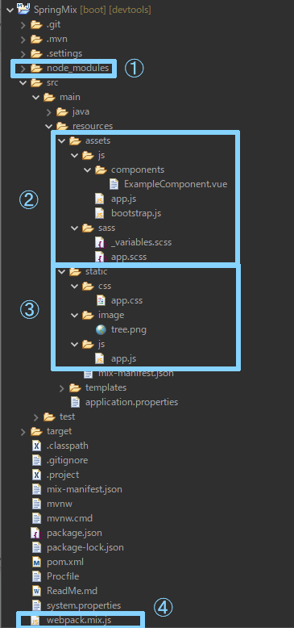

# Java Spring Bootでフロントを楽しく開発するサンプルプロジェクト

### はじめに

JavaのWebアプリケーションは、サーバーサイドで動作するバックエンドのアプリです。

しかし、実務ではフロント(CSSやJavaScript)の開発も欠かせません。

いちいちCDNでリンクを張って必要なモジュールを読み込んでいては、テンプレートの可読性が下がるばかりか、

ネットの通信回数と通信量が増え、画面表示に時間がかかったりと、デメリットが多くなります。

そこで、JavaScriptやCSSのモジュールを一元管理し、コンパクトにまとめて使いやすいように変換してくれるツールが登場しました。

それがWebpackです。

Webpackはサーバーサイドで動作する、今や大人気のJavaScriptのフレームワークです。

ただ、Webpackの設定ファイルであるwebpack.config.jsが結構煩雑な内容で、初心者向けではありません。

なんとかならないかとネットを検索していたら、こんなGitHubを見つけました。


[spring-boot-pebble-laravel-mix](https://github.com/flof/spring-boot-pebble-laravel-mix)

元々はphpのlaravelというフレームワーク向けに開発されたlaravel-mixを組み合わせることで、さらに手軽に使えるようにしようという試みです。

残念ながらそのままでは動作してくれませんでしたが、色々と手直しをしたところ、

app.jsとapp.cssを読み込むだけで、bootstrap、Sass、jQuery、Vueといった代表的なCSSやJavaScriptのフレームワークが、そのまま直感的に使えるようになりました。

煩わしい設定は必要ありません。

各ページ用に新しくscssファイルを作成する場合でも、webpack.mix.jsに一行追加するだけで、scss→cssのコンパイルが可能です。

オリジナルアプリ開発の一助になれば幸いです。
        

### 導入方法

 [このプロジェクトをHerokuにデプロイしたサンプルページ](https://sprimgmix.herokuapp.com/)
 
 こちらのサンプルページの項目は、各々どんなツールなのかの説明や使い方の参考サイトへのリンクになっています。
 
※Windowsの方は管理者用コマンドプロンプトで作業して下さい

1. 上記Nodeの参考サイトで、nvmとNode(npm)をインストールして下さい。Nodeのバージョンは、v16.13.2を選んでください。
 
1. cdで、eclipseのワークスペース直下に移動してください。
 
1. git clone https://github.com/MutsumiMatsuda/springmix あなたのプロジェクト名
 
1. SpringMixApplication.javaを、あなたのプロジェクトに合わせてリファクタリングして下さい。
 
1. GitHubにリモートリポジトリを作って下さい。
 
1. git remote set-url origin コマンドで、あなたのリモートリポジトリをプロジェクトに設定して下さい。
 
1. npm install
 
1. npm run dev
 
1. eclipseの4でリファクタリングしたjavaファイルを選択し、実行->Spring Bootアプリケーション
 
1. localhost:8080にブラウザでアクセスし、動作確認して下さい。


### 使い方

プロジェクト内で覚える必要があるのは、以下4つのフォルダとファイルだけです。



#### ①node_modules
npm install を実行すると、作成されるフォルダです。

中を開けると、恐ろしい数のフォルダとファイルがありますが、決して変更や削除はしないでください。

ここは、WebpackでコンパイルするcssとJavaScriptの原材料やツールが保管されている大切な場所です。

ここにあるものを使って、テンプレートで読み込むcssやjsファイルを作成するわけです。

ただし、Webアプリの動作時には不要なフォルダ(デプロイ不要)ですので、.gitignoreに登録してあります。

#### ②src/main/resources/assets
作成するcssやjsの内容を設定するファイルを置く場所です。

私が勝手に作ったフォルダですので、各自好みに合わせて、フォルダ名や場所を変えても大丈夫です。

その場合は、後述のwebpack.mix.jsを変更して下さい。

このプロジェクトでは、app.scssにフォントやその他の基本設定を、app.jsではBootstrapを読み込み、Vue、Font Awesomeの準備をしています。

BootstrapはjQueryを使って動作しているので、jQueryの準備は、bootstrap.jsで行っています。

#### ③src/main/resources/static
ここは、実際にアプリの動作時に読み込むcssやJavaScriptのファイルが置かれる場所です。

つまり、Webpackのコンパイル結果が配置されるところ、ということです。

場所やフォルダ名は変更しないようにしましょう。

#### ④webpack.mix.js
どこにあるどんなファイルを、どこにコンパイルして配置するか、を指定するlaravel-mixの設定ファイルです。

元々のWebpackの設定ファイルよりも、大変使いやすく単純化されており、laravel-mix内部にwebpack.config.jsを持ち、webpack.mix.jsの単純な設定だけでWebpackが動作するように作られています。

webpack.mix.jsの大まかな構造は、以下の通りです。

```
const mix = require('laravel-mix');

mix
  .sass(変換元のscssファイル, 変換先)
  .js(変換元のjsファイル, 変換先)
  .setPublicPath("src/main/resources/static/")
;
```


最後のsetPublickPathで、コンパイル結果のファイルをどこに出力するかの場所を指定しています。

何行もあるように見えますが、これは、mixというオブジェクトにドットでつなげて処理を追加しているだけで、コードは一行文しかありません。

```
mix.処理1().処理2().処理3()...処理x();
```

と、書いてあるのと同じです。


ですから、例えば、common.scssというファイルを追加でコンパイルしたい場合は、次の一行を追加してやるだけでOKです。

```
  .sass('src/main/resources/assets/sass/common.scss', 'css')
```


それでは、フロントにも力を入れて、見た人がうなるような、オリジナルアプリを作ってみましょう！


Enjoy your coding!!